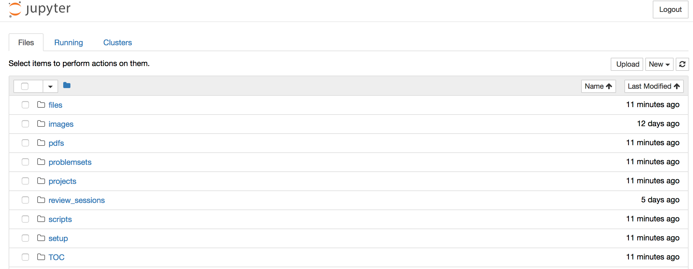
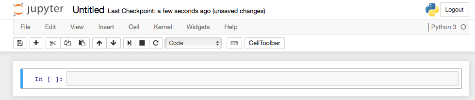
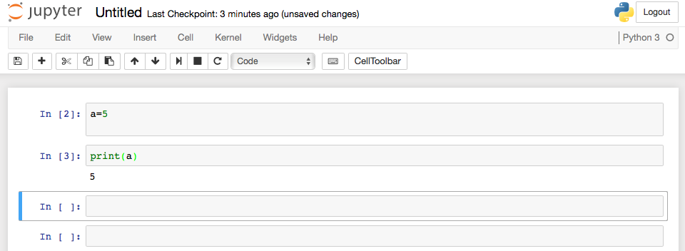
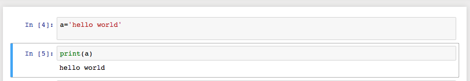
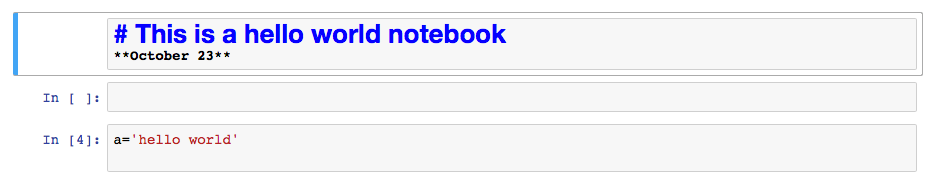
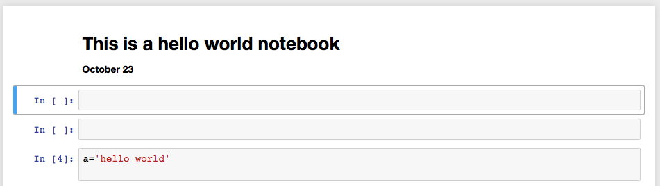
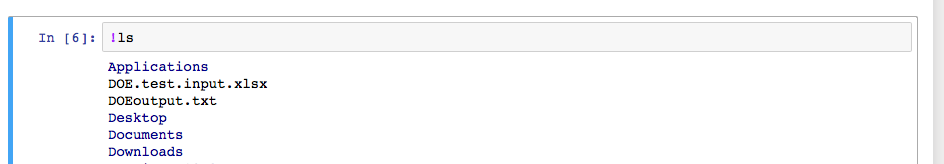
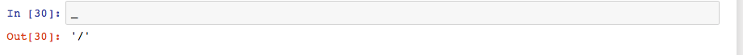

# Jupyter Notebook (JN)

Previously called iPython notebook. An interactive 'lab notebook' for writing code experiments. It stores code and can link to data files and can run the code on the data. Oh, and it looks like a web page and runs inside your web browser, so you can add formatting and images (plots, graphs, diagrams, photos etc).  

You can run a notebook locally (we'll be doing that) or over a network from a server.

The notebooks we'll be running run python (inside a 'kernel'). There are kernels for many languages. The most interesting alternative for bioinformatics is R, a statistical language that has amazing graphing and other analysis tools.

Having your code documented in a notebook means you can rerun it any time and get exactly the same output.  You can also share easily and document what you did clearly. It's perfect for bioinformatics projects.

## Installing jupyter notebook

You'll need a good browser like firefox or chrome. Others might work ok. You also need python 3.3+

JN is part of [anaconda](https://store.continuum.io/cshop/anaconda/) created by Continuum , so it's on the computers we are using. You can also get it through `pip`  or conda `conda install jupyter`

You'll launch it like this

```bash
% jupyter notebook &
```

Remember the `&` means run this command in the background. Jupyter starts in the directory you are in when it's launched.

You'll see a lot of messages appear in the screen and a broswer window will open. 





You can start a new project and make other files with the New drop down menu

Let's click on the projects folder and make a new folder in there. Click on the box next to the new 'Untitled Folder' and select rename above to chance the name to final_project. 


If you click on the final_project directory, you'll see a new empty directory.

Now we can make a new python3 notebook.




You'll see a blue bar on the left of the box. This is called a 'cell'. If you select the cell it changes to green

You can start typing python. Return lets you type in several lines of python at once. Option-return runs each box as you finish typing commands. 



You can also use the play and stop and rerun buttons.

Let's change a to be a string and rerun the `print(a)` code with the play button. Note line number change and the output has changed too!



## Adding text, changing formatting

You can add headers and other text, that will for example explain what you are doing, by changing the format of a box to Markdown.



When you have finished typing you can run the cell to convert to formatted text



## Rename your notebook

Don't forget to rename your notebook to something more descriptive. Click on the 'Untitled' at the top. You can save changes by clicking on the floppy disk icon.

## Edit menu

There are tons of useful features here, including deleting cells, moving them up or down in the list and so on.


## Cell menu

Run cells or groups of cells. Change cell type


## Kernel menu 

Controls to start, stop suspend the kernel running your python


## Git and JN

You will definitely want to commit and push before you make edits to your notebook. If you make a mess, you'll be able to roll back the changes. Great for collaborating with your project team! 

github know how to render .ipynb files (the format for these notebooks) so you can display the files nicely on the github website.

## File and command completion

Tab completes filenames and commands. Useful for opening local files if you know their name. You can type this `file = open('<TAB>` and see a list of files.

## Unix commands

Start a cell with `!` then the unix command you want to run



Some unix commands are also available as magics

## 'Magic' commands

Start these with `%` for a single line magic command or `%%` for a multi-line magic command

%run           run some python script
%timeit      time some code
%cd            change directory, and keep track of directories you have visited

You can view the previous output with `_`, also `__` and `___`


Some magic commands are available as just the command (note different outputs and see more detailed documentation if you are curious)


## Help

`len?`  

more help  

`len??`  
